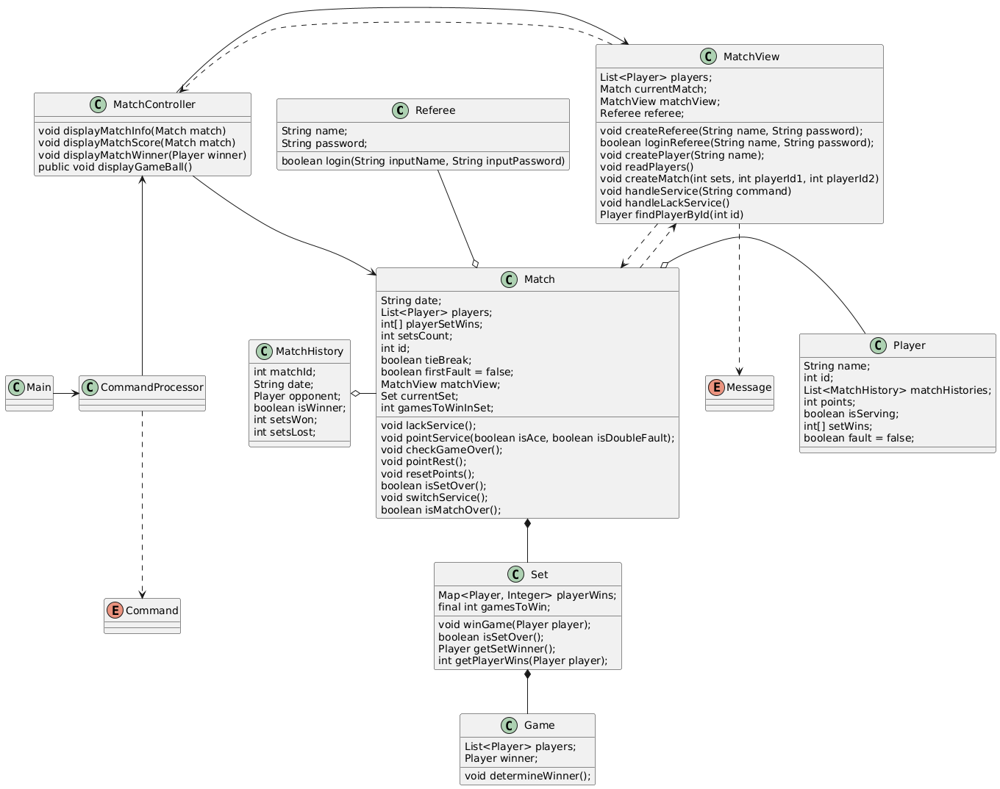

Yinan Shangguan : 
Considero que solo merezco un 5, ya que, aunque hice mi mayor esfuerzo para modificar el código, 
algunas funcionalidades aún no se han logrado implementar. Probé varias soluciones, pero los resultados no fueron los esperados y no alcancé el resultado ideal.

Hao Zhu :
Lamentablemente, creo que solo obtendremos 5 puntos en este proyecto. 
Aunque invertimos mucho tiempo en el diseño, tuvimos problemas en la implementación del código. No logramos corregir varias lógicas importantes, 
hicimos nuestro mejor esfuerzo dedicandolo,espero en la proxima trabajo podemos hacer mejor.

